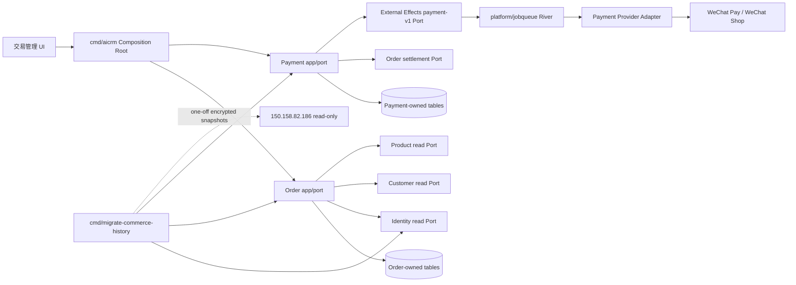

# PRD：交易管理与历史用户数据迁移

## 1. 文档信息

- 状态：方案已批准，开发与生产只读盘点进行中；全量迁移受源权限门禁阻塞
- 日期：2026-09-03
- 本期唯一业务范围：交易管理
- 代码供体：`AI-CRM-v2@6bfbe5816bb89913c70adaca87d6a486260e016e`
- 当前 v3 开发基线：`origin/main@723b90914c20fe12bf07507e3683112816cf4fe3`
- 数据源：`150.158.82.186` 上的现生产 PostgreSQL；可授权视图已完成只读盘点，退款/微信小店/支付宝源表仍未授权
- 产品 Owner：CRM Commerce
- 数据 Owner：Order、Payment、Identity、Customer（各自只写本域表）

本 PRD 中“所有过往用户数据”解释为：迁移全部历史用户/身份行，并迁移全部订单、商品明细、支付终态、退款终态和必要事件；每一源行都必须进入 canonical、archive、quarantine、conflict 或 invalid 中唯一一个可对账结果桶。问卷、聊天、标签、群运营、Campaign、优惠券领取、会员权益等其他业务数据不在本期迁移范围。

## 2. 开发前最高优先级分类

```text
OneID: reads canonical customer + resolves scoped identity + provisions customer only from verified/authoritative identity + records conflicts; no automatic merge.
Persistence: local transaction + internal durable job + Provider read + Provider write/external effect.
External Effects: WeChat Pay prepay/refund and WeChat Shop refund are involved; Alipay remains imported/read-only because the v2 donor has no closed Alipay write/refund Provider capability.
```

- `customers.id` 是交易受益人的唯一渠道中立主键。
- 实际付款人和订单受益人是两个概念；`payer_identity_id/payer_customer_id` 可以与 `beneficiary_customer_id` 不同。
- HTTP 请求不得提交 raw external_userid/openid/手机号并宣称已验证，也不得仅凭手机号建客或合并客户。
- 订单、订单项、导出与历史导入由 Order 拥有；支付尝试、回调、退款和对账由 Payment 拥有。
- 一次金融命令需要跨 Order、Payment、审计、Outbox、External Effects 接受原子提交时，所有 Port 必须使用同一个 PostgreSQL Unit of Work。
- Provider 网络调用必须发生在事务之外；`accepted/queued/executed` 都不是支付或退款成功。

## 3. 现状结论

### 3.1 v3 当前状态（2026-09-03 第一批开发后）

- `modules/registry.yaml` 中 `order`、`payment` 已为 `contracted`，只表示供体契约冻结，不代表能力上线。
- Order 聚合、Port、事务型 PostgreSQL Store 与 `0017_order.sql` 已在开发分支完成；Payment 仍为占位。
- `/admin/orders` 仍只有明确不可用的 v3 壳，没有挂载订单 API 或 donor 业务动作。
- v3 的 `orders.html`、`orderDetail.html` 与冻结 v2 commit 字节一致；页面资产可复用，不需要重新设计。
- `web/src/api/capabilities.ts` 已改为类型化 `transactionReadiness`，订单读取和全部退款在真实 API/Journey 完成前保持 `backend_blocked`。

### 3.2 v2 可复用能力

| 能力 | v2 真实状态 | v3 决策 |
|---|---|---|
| 统一订单列表、筛选、分页 | 本地 PostgreSQL 读模型 | 迁移行为，重写为 v3 Order Store |
| 订单详情、商品项、退款和效果时间线 | 已有契约和前端 | 迁移，按 Order/Payment Owner 拆分 |
| 微信、支付宝、微信小店分 Provider 查询 | 已有读接口 | 迁移 |
| CSV 导出、预览、公式注入防护 | 已有本地能力 | 迁移，限制 10,000 行/5 MiB |
| 微信支付 checkout/prepay | 已有本地订单和 Provider Adapter | 迁移，但移除浏览器直传 `customer_id` 的设计 |
| 微信支付支付/退款回调 | 有验签、解密、幂等回执 | 迁移到 Payment 域 |
| 微信支付退款与 `outcome_unknown` 对账 | 有本地实现 | 迁移并复用 v3 External Effects |
| 微信小店订单物料读取、退款、回调、查询对账 | 有实现，Provider 默认 disabled | 迁移并按 v3 job/effect 内核改造 |
| 支付宝交易 | 只有持久化读取 | 仅做历史导入、列表、详情和导出；不虚构支付宝退款 |
| V1 历史订单/退款 | v2 只做微信历史只读 | 扩展为三 Provider 的安全历史读模型 |
| 生产迁移 | v2 只有本地/合成证据 | 重新设计并在 v3 做真实 dry-run、apply、reconcile |

## 4. 目标与成功标准

### 4.1 业务目标

1. 管理员能在一个页面查询微信支付、支付宝、微信小店全部历史和 v3 新订单。
2. 详情页能区分订单事实、付款事实、退款事实、外部效果状态和历史只读事实。
3. 微信支付新 checkout、支付回调、退款和对账闭环可用；微信小店退款闭环可用；支付宝保持真实的只读边界。
4. 交易按当前 OneID 精确归属，付款人与受益人不同也不会错误合并。
5. `150.158.82.186` 中本次定义范围内的全部历史用户与交易行可逐行对账，没有静默丢弃。
6. 切流后 v3 是交易唯一主写；旧系统只保留只读回滚窗口，不形成双主写。

### 4.2 完成定义

以下全部满足才可称为“交易管理完成”：

- 页面不是壳，列表/详情/筛选/分页/导出均由 v3 数据驱动。
- 微信支付和微信小店的真实 Provider 能力经过预发验证；生产开关仍需独立审批后启用。
- 回调重放只结算一次，金额或身份漂移返回冲突。
- 历史导入完成 `inspect -> dry-run -> apply -> delta -> reconcile`，全部恒等式成立。
- 抽样订单在源库、快照、v3 API 和页面四处一致。
- 没有 raw external ID、手机号、Cookie、Token、私钥、回调正文或完整 Provider 响应进入结构化日志。
- 未完成权益模块时，交易页面明确显示“支付已结算，权益处理不在本期”，不得宣称权益已发放。

## 5. 用户与权限

| 操作 | SuperAdmin | Admin | Ops/Viewer |
|---|---:|---:|---:|
| 列表、详情、时间线 | 允许 | 允许 | 允许只读 |
| 导出预览 | 允许 | 允许 | 允许只读 |
| 下载 CSV | 允许 | 允许 | 默认禁止，可单独授权 |
| 创建退款 intent | 允许 | 允许 | 禁止 |
| 人工发起对账 | 允许 | 允许 | 禁止 |
| 开启 Provider/切流 | 受控运维 | 禁止 | 禁止 |
| 运行历史迁移 CLI | 受控运维 | 禁止 | 禁止 |

所有写操作要求 human session、RBAC、同源校验、CSRF、`Idempotency-Key` 和不可变审计。金融和导出响应使用 `Cache-Control: private, no-store`。

## 6. 产品范围

### 6.1 本期交付

- `/admin/orders` 统一交易列表和 `/admin/orders/{order}` 详情。
- 单号、付款人/OneID、商品、Provider、支付状态、退款状态、时间范围筛选和稳定翻页。
- 订单项、付款/退款/外部效果/回调摘要的合并时间线。
- 安全 CSV 预览和导出。
- 微信支付 checkout、短时 JSAPI handoff、支付回调、退款回调和主动对账。
- 微信小店订单物料 Provider read、退款 intent、退款回调和主动查询对账。
- 支付宝历史交易只读。
- 全量历史用户/身份和交易数据的一次性迁移、增量追平、冲突隔离和对账。
- Provider disabled/readiness、审计、指标、告警和运行手册。

### 6.2 明确不做

- 支付宝新下单、支付宝退款、支付宝 Provider 写入。
- 商品管理、优惠券领取/核销、会员权益、周期会员表、发票、物流和库存履约。
- 客户画像、标签、问卷、聊天、群运营、Campaign 历史数据迁移。
- 通过手机号、姓名、昵称、金额、相近时间或“最像的客户”推断 OneID。
- 自动合并两个 Customer 根。
- 长期连接旧生产数据库、运行时回查旧库或长期双写。
- 从历史终态生成新的回调、任务、退款、权益或 Provider 外部效果。

## 7. 核心用户旅程

### 7.1 查询交易

1. 用户打开交易管理，默认按 `created_at DESC, id DESC` 查询。
2. 服务端把筛选条件写入签名 cursor，翻页使用固定 watermark，避免新订单造成重复或漏行。
3. 付款人搜索先通过 Identity 只读 Port 精确解析为 Customer/Identity 集合，再查询 Order；Order Store 不读 Identity 表。
4. 列表显示来源、历史/原生标记、订单号、受益 OneID、付款人脱敏摘要、商品快照、金额、支付和退款状态。
5. 详情页将 Order/Payment 各自投影在 Composition 层组合，不跨域查表。

### 7.2 发起退款

1. Admin 打开原生且可退款的订单详情。
2. 页面要求填写金额、原因、完整订单号二次确认和确认勾选。
3. Payment 在同一 UoW 内锁订单，通过 Order Port 校验可退款余额，创建退款、幂等收据、审计、Outbox 并通过 External Effects transactional Port 接受外部效果。
4. API 返回 `accepted/queued`，页面显示“退款处理中”，绝不显示“退款成功”。
5. Worker 在事务外调用 Provider；回调或主动查询才将退款置为 `succeeded/reconciled/final_failed`。
6. `outcome_unknown` 只能使用原幂等键查询或对账，禁止重新创建退款。

### 7.3 创建并完成微信支付

1. 可信 OAuth/支付会话 Adapter 获取带 App scope 的 verified OpenID，并通过 Identity Port 解析/显式建客。
2. Checkout HTTP 只接受商品和受益人选择策略，不接受调用者自报的 raw identity 或任意 `customer_id`。
3. Order 冻结商品版本、价格、币种和受益 Customer；Payment 冻结付款 identity、命令和四个效果 digest。
4. 同一 UoW 提交订单、支付命令、收据、审计、Outbox 和 External Effects 接受。
5. Provider prepay 在事务外执行，短时 JSAPI handoff 仅能被原支付会话读取。
6. 验签/解密后的回调按订单号、金额、币种和 Provider 交易摘要落幂等回执；重复回调只返回原结果。

### 7.4 历史迁移

1. 使用已验证 host key 和受限只读账号盘点源 schema、约束、行数、金额、空值、重复值和时间水位。
2. 先导出用户/身份最小快照，再导出订单、订单项、支付终态、退款终态和允许的事件摘要；每个文件单独生成 SHA-256 和列 manifest。
3. 用户/身份先走 Identity/Customer 迁移或现有企微全量同步；不可解析记录进入 identity quarantine。
4. Order 导入通过 Identity Port 查找受益人和付款人；无法唯一解析时允许历史订单 `beneficiary_customer_id=NULL`，但必须保存脱敏快照和冲突收据。
5. 历史支付/退款只写 `record_origin=production_history` 的终态事实，强制 `effect_eligible=false`。
6. 全量导入后按 `(updated_at, source_pk)` 拉取 T0-T1 增量；源交易写入口停写后做最后 delta 和对账。
7. 全量恒等式、金额对账和抽样通过后再切换读路由；写路由最后切换，避免双主写。

## 8. 领域架构



### 8.1 数据所有权

| Owner | 拥有的事实 | 禁止行为 |
|---|---|---|
| Order | 订单、订单项、受益 Customer 引用、付款 identity 引用、金额/币种、订单状态、历史导入收据和交易读模型 | 不验签、不调用 Provider、不写 Identity/Product 表 |
| Payment | 支付命令/尝试、回调收据、退款、Provider receipt、对账和 effect 绑定 | 不直接写 Order 表；只经 Order Port |
| Identity | scoped identity、assurance、归属、冲突/merge candidate | 不从订单号、手机号或昵称猜客户 |
| Customer | `customers.id` 根与有效根解析 | 不拥有支付身份 |
| Product | 商品和价格/版本来源 | 不写订单或支付 |
| External Effects | 通用 lease/fence/attempt/状态/队列语义 | 不存 raw 身份、订单正文或 Provider 秘密 |

### 8.2 建议表

Order-owned：

- `orders`：原生与历史统一聚合，包含 `provider`、商户/平台单号、`beneficiary_customer_id`、`payer_identity_id`、`payer_customer_id`、金额、结算/退款金额、状态、来源、版本和时间。
- `order_items`：购买时不可变商品快照；不回读当前商品覆盖历史。
- `order_status_history`：只存版本化业务状态事实和安全摘要。
- `order_export_receipts`：导出幂等、筛选 digest、行数/字节数、过期时间；不持久化明文 CSV。
- `order_import_runs/receipts/quarantines`：源 manifest、source key digest、payload digest、target digest、结果桶和错误码。

Payment-owned：

- `payment_commands`、`payment_attempts`、`payment_callback_receipts`。
- `payment_refunds`、`payment_refund_attempts`、`payment_reconciliations`。
- `payment_effect_bindings`：业务命令到 `effect_id` 的唯一绑定。
- `payment_provider_material`：只保存最小必要加密/摘要字段；短时 handoff 设 TTL。

历史行必须带 `record_origin=production_history` 和 `effect_eligible=false`；数据库约束禁止为历史行创建 Payment command 或 External Effect。

## 9. OneID 归属规则

归属优先级不是“谁先匹配到谁”，而是逐条证据按 scope 精确解析：

1. 已存在的 v3 `customer_identities` 精确键：`kind + scope + normalized_value`。
2. 生产源中有完整 namespace 且能证明来源权威的 first-party member ID 或 Provider identity，可由受控迁移 Adapter 构造 verified fact，再显式 provision。
3. `(corp_id, external_userid)` 只能映射 `wecom_external_userid@wecom-corp:<corp_id>`。
4. OpenID 没有 AppID 不映射；UnionID 没有开放平台 scope 不跨渠道；支付宝五种 ID 不互换。
5. 手机号只作为 declared identity 附着到已唯一解析的 Customer，不能建客、合并或升级 verified。
6. 多个 Customer 命中同一强证据时写 conflict/merge candidate；本期不自动合并。
7. 历史订单无法唯一归属时保持 floating，不阻塞订单事实迁移，也不把付款人快照当 OneID。

## 10. API 契约

保留当前供体前端需要的兼容路由，OpenAPI 是唯一机检基线：

- `GET /api/admin/orders`
- `GET /api/admin/orders/{order_ref}`
- `GET /api/admin/orders/{order_ref}/items`
- `GET /api/admin/refunds`
- `POST /api/admin/exports/preview`
- `POST /api/admin/exports`
- `GET /api/admin/exports/{job_id}`
- `GET /api/admin/alipay/transactions`
- `GET /api/admin/wechat-pay/orders`
- `GET /api/admin/wechat-pay/orders/{order_ref}/external-push-deliveries`
- `POST /api/admin/wechat-pay/orders/{order_ref}/refunds`
- `POST /api/admin/wechat-shop/refunds/{refund_id}/reconcile`
- `POST /api/v1/wechat-pay/checkouts`
- `GET /api/v1/wechat-pay/checkouts/{merchant_order_no}`
- `POST /api/public/wechat-pay/callbacks/payment`
- `POST /api/public/wechat-pay/callbacks/refund`
- `GET|POST /api/public/wechat-shop/callbacks/refund`

兼容 `order_ref` 必须解析到唯一订单；同字符串在多个 Provider 命中时返回 409，不猜测。订单 API 默认不返回 raw external ID、完整手机号、回调正文或 Provider 秘密。

## 11. 状态与错误语义

订单：`created -> awaiting_prepay -> awaiting_payment -> paid -> partially_refunded -> refunded`，并允许 `cancelled/final_failed` 的明确终态。

外部效果：`accepted -> queued -> attempted -> executed | outcome_unknown | retryable_failed | final_failed -> reconciled`。

- `executed`：请求执行完成，不代表付款/退款成功。
- `paid/refunded`：仅来自通过验签的 Provider 回调或主动查询后的可信对账。
- 金额、币种、商户单号、Provider 单号或 identity 漂移：409 + 审计，不能覆盖。
- Provider disabled：503 readiness，且必须证明零网络调用。
- 历史行退款请求：409 `historical_order_read_only`。
- 导入冲突：隔离当前行并继续统计；结构/manifest 漂移：整个 run 停止。

## 12. 历史数据迁移方案

### 12.1 生产前置门禁

- 已验证 `150.158.82.186` host key、受限只读账号和允许命令。
- 数据 Owner 批准表清单、字段白名单、快照保留期和停写窗口。
- `crm-prod` 受限入口已验证，只允许只读 `SELECT`。当前可见 `audience_read.identity_universe_v1` 与 `audience_read.orders_v1`；底层退款、微信小店和支付宝表存在，但只读账号无权访问，不能据部分视图执行全量导入。
- 当前可见聚合基线：身份宇宙 25,649 行、24,255 个唯一身份、1,369 个 person；微信支付订单 769 行，订单金额合计 95,518,218 分。以上是部分源覆盖，不是全量迁移完成证明。
- UnionID 记录没有可从生产配置确认的微信开放平台 scope。必须由数据 Owner 提供 `wechat-open-platform:<scope>`，否则不得以 UnionID 建客或跨渠道归属。
- 源备份已完成并做可恢复性验证；目标 v3 在导入前也生成备份。
- Provider 开关全部保持 disabled；迁移进程不得注册 Payment/Refund Worker。

### 12.2 发现报告必须输出

- PostgreSQL 版本、数据库/schema 清单和每表 Owner。
- 交易候选表：`wechat_pay_orders/events/refunds`、`wechat_shop_orders/events/refunds`、`alipay_pay_orders/events` 及现场发现的同义表。
- 用户候选表：`crm_user_identity*`、`wecom_external_contact_identity_map`、客户主表及现场发现的同义表。
- 主键、唯一键、FK、时间列、软删语义、金额单位/币种、Provider 状态枚举。
- 每表总数、空值、重复 source key、最早/最晚时间、金额总计和退款总计；仅输出聚合，不输出 PII。

### 12.3 快照包

```text
manifest.json
users.jsonl.enc
identities.jsonl.enc
orders.jsonl.enc
order_items.jsonl.enc
payments.jsonl.enc
refunds.jsonl.enc
events.jsonl.enc
```

Manifest 记录 schema version、源表/列、source SHA、T0/T1 watermark、行数、明文 canonical digest、密文 digest、加密 key version 和导出工具版本。快照位于受控目录，权限 `0600`，不得提交 Git；密钥不与快照同机长期保存。

### 12.4 结果桶与恒等式

```text
source_user_rows = provisioned + linked + conflict + unresolved + invalid + duplicate_same
source_identity_rows = attached + already_linked + conflict + unresolved_scope + invalid + duplicate_same
source_order_rows = imported + duplicate_same + conflict + quarantined + invalid
source_item_rows = imported + duplicate_same + missing_order_quarantine + conflict + invalid
source_payment_rows = imported_terminal + duplicate_same + missing_order_quarantine + conflict + invalid
source_refund_rows = imported_terminal + duplicate_same + missing_order_quarantine + conflict + invalid
```

另需按 Provider、币种、自然日、状态对账订单笔数/金额、支付金额和退款金额；退款累计不得超过可信已结算金额。所有恒等式必须为 100%，不能用“误差率”替代。

### 12.5 回滚

- 导入按 run ID 标记；切流前可 CAS 退役本 run 新建的历史映射和投影，但不硬删审计、receipt、conflict 或 quarantine。
- 已被 v3 新交易引用的 Customer/Identity/Order 禁止自动回滚，必须转人工处置。
- Provider callback/退款一旦生产启用，不通过数据库回滚撤销外部事实；只允许版本回退、入口关闭和原键对账。
- 源系统在最终验收和约定观察期内保持只读可回退；观察期结束后再单独审批退役。

## 13. 非功能要求

- 列表 API：50 条默认页，100 条最大页，正常索引命中下 p95 < 500 ms。
- 订单详情：p95 < 500 ms；不得为每条时间线发起 N+1 跨域查询。
- 导出：最多 10,000 行、5 MiB，防 CSV 公式注入，生成物短时保存或流式返回。
- 迁移：可断点续传、同 manifest 重放无新增、payload 漂移失败；吞吐目标在生产行数盘点后确定。
- 财务数据 RPO=0（已提交数据库事实），应用 RTO <= 4 小时；迁移窗口 RPO=0。
- 结构化日志仅含内部 ID、digest、阶段和错误码；禁止 PII/Secret。
- 关键指标：订单写入、回调验签失败、重复回调、金额冲突、effect unknown、对账滞留、导入结果桶和 quarantine 增长。

## 14. 测试与验收

### 14.1 自动测试

- Money/状态机/可退款余额/付款人与受益人分离的领域测试。
- 同一订单号并发只创建一次；同键异 payload 冲突。
- 同一回调并发只结算一次；金额/币种/Provider ref 漂移拒绝。
- Order、Payment、receipt、audit、Outbox、effect 接受任一失败则整体回滚。
- Provider 网络调用期间无数据库事务。
- `outcome_unknown` 不产生第二退款，不换幂等键。
- OneID scope、无 scope OpenID/UnionID、手机号 declared 和多根冲突测试。
- 历史导入三 Provider、重放、断点、delta、quarantine、rollback 和金额对账测试。
- RBAC、CSRF、no-store、CSV 注入、cursor 篡改、模糊 order ref 冲突。
- 供体前端 hash、TypeScript、浏览器交互和真实 v3 API 合同测试。

### 14.2 上线验收

1. 本地 `make check`、相关 race tests、OpenAPI/前端构建、安全扫描通过。
2. 预发用脱敏生产等价数据完成全量和 delta 演练。
3. Provider disabled 下部署 schema/API/UI，确认零网络调用。
4. 只读历史导入和 UI shadow 对比通过后先切读。
5. 微信支付/微信小店分别小流量灰度；每种 Provider 都需要一笔真实支付/退款或平台允许的等价沙箱证据。
6. 最终停写、delta、恒等式和抽样通过后切写；监控一个完整结算周期。

## 15. 分 PR 交付顺序

| PR | 可观察交付 | Provider 状态 |
|---|---|---|
| PR-TX01 | 冻结供体行为、OpenAPI、OneID/效果 ADR、修正 capability readiness | disabled |
| PR-TX02 | Order 聚合、表、列表/详情/筛选/分页真库能力 | disabled |
| PR-TX03 | 三 Provider 历史导入 CLI、receipt/quarantine/reconcile | disabled |
| PR-TX04 | 原样交易 UI 接真实 API、安全导出和页面验收 | disabled |
| PR-TX05 | Payment 聚合、payment-v1 External Effects 契约和 Fake Adapter | disabled |
| PR-TX06 | 微信支付 checkout、验签回调、退款和主动对账 | 默认 disabled |
| PR-TX07 | 微信小店物料读取、退款、回调和主动对账 | 默认 disabled |
| PR-TX08 | 生产全量/delta 迁移、shadow、切读、灰度切写与观察 | 分阶段审批 |

每个 PR 只在自身用户能力、真库测试和部署/运行证据完成后推进模块状态。CI 绿、HTTP 200、Fake Provider 或“任务已排队”都不能单独作为完成证据。

## 16. 决策点与阻断条件

正式执行前只剩三个必须由现场事实确认的决策：

1. 生产源的真实数据库/schema/表和用户主键是什么。
2. 历史用户中哪些字段具有足够 provenance 可形成 verified first-party/provider identity，哪些只能 declared/archive/quarantine。
3. v3 交易切写时，旧系统对应写入口的精确停写方法和回滚窗口。

出现以下任一情况立即停止：双主写、身份错误归属、支付/退款可能重复、回调验签绕过、Secret/PII 泄漏、跨领域表写入、独立事务造成半提交、不可逆数据损坏、迁移恒等式不成立或源 schema 漂移。
